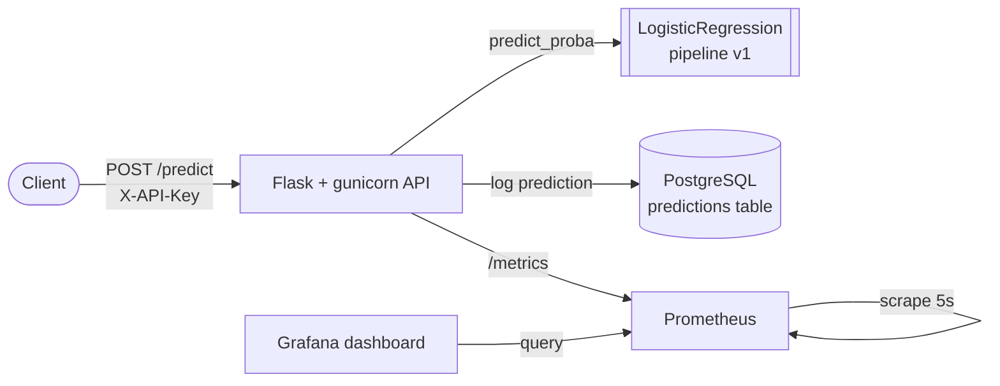

# 🌸 Iris Model — End-to-End MLOps Pipeline

[](https://github.com/axumweyane/iris-model/actions/workflows/ci.yml)
[](https://www.python.org)
[](LICENSE)

A production-shaped machine-learning service built to demonstrate that a model isn't "done" when it's trained — it's done when it's **deployed, logged, monitored, tested, and shipped through CI**. The model itself is deliberately simple (Iris classification); the point is the operational scaffolding around it.

Train → serve behind an authenticated API → log every prediction to Postgres → expose Prometheus metrics → visualize in Grafana → verify with tests in GitHub Actions. One command brings the whole stack up.

---

## Architecture



Every prediction flows three ways: back to the client, into the Postgres **prediction log** (the substrate for drift / delayed-accuracy analysis), and into **Prometheus counters/histograms** that Grafana renders live.

---

## What this demonstrates

- **Model serving** — a versioned scikit-learn pipeline loaded once at startup and served behind a REST API.
- **Prediction logging** — every inference is written to Postgres with its inputs, output, confidence, latency, and a request id — the foundation any monitoring layer reads from.
- **Observability** — Prometheus metrics (`/metrics`) scraped and displayed on a provisioned Grafana dashboard.
- **Reliability** — a DB outage degrades logging but never fails a prediction; input is validated and the endpoint is API-key protected.
- **Testing & CI** — a hermetic pytest suite (DB mocked) and a GitHub Actions pipeline that trains, tests, and builds the Docker image on every push.
- **Reproducibility** — pinned dependencies, a self-contained Docker image, and `.env`-driven config that works identically on host and inside the compose network.

---

## Quick start

**Prerequisites:** Docker + Docker Compose.

```bash
git clone https://github.com/axumweyane/iris-model.git
cd iris-model
cp .env.example .env            # set your own API_KEY / DB_PASSWORD
docker compose up -d --build    # builds the API (trains the model), starts all 4 services
```

| Service | URL | Notes |
|---|---|---|
| API | http://localhost:8000 | `GET /`, `/health`, `/metrics`, `POST /predict` |
| Grafana | http://localhost:3000 | dashboard **Iris Model — Overview** (anon viewer; admin/admin) |
| Prometheus | http://localhost:9090 | try `sum(iris_predictions_total)` |
| PostgreSQL | localhost:**5433** | mapped off 5432 to avoid clashing with a host Postgres |

Tear down with `docker compose down` (data persists in named volumes).

---

## API usage

```bash
# Health
curl localhost:8000/health

# Predict (X-API-Key must match your .env)
curl -X POST localhost:8000/predict \
  -H "X-API-Key: dev-key-change-me" \
  -H "Content-Type: application/json" \
  -d '{"sepal_length_cm":5.1,"sepal_width_cm":3.5,"petal_length_cm":1.4,"petal_width_cm":0.2}'
```

```json
{
  "predicted_class": "setosa",
  "confidence": 0.9808,
  "model_version": "v1",
  "latency_ms": 0.76,
  "request_id": "…",
  "logged_id": 42
}
```

Bad input returns `400` with a clear message; a missing/invalid key returns `401`.

---

## Metrics

Exposed at `/metrics` and scraped by Prometheus every 5s:

| Metric | Type | Meaning |
|---|---|---|
| `iris_predictions_total` | counter | predictions, by `predicted_class` and `model_version` |
| `iris_prediction_latency_seconds` | histogram | model inference latency |
| `iris_prediction_confidence` | histogram | confidence of the predicted class |
| `iris_requests_total` | counter | HTTP requests by endpoint/method/status |
| `iris_errors_total` | counter | errors by type (auth / validation / log) |

> The API runs gunicorn with **one worker + threads** so all counters share a single Prometheus registry (multi-worker would split counts across registries).

---

## Testing & CI

```bash
python -m venv .venv && source .venv/bin/activate
pip install -r requirements-dev.txt
python src/train.py        # produce a model artifact (git-ignored)
pytest -v                  # 10 tests: schema validation + API (DB mocked)
```

GitHub Actions ([`.github/workflows/ci.yml`](.github/workflows/ci.yml)) runs on every push:
- **test** — install → train → `pytest`
- **docker-build** — `docker build` the API image

---

## Project structure

```
iris-model/
├── src/
│   ├── train.py        # train + version the model -> models/latest.json
│   ├── app.py          # Flask API: /health /metrics /predict
│   ├── database.py     # psycopg2 prediction logging
│   ├── schema.py       # request validation
│   └── metrics.py      # Prometheus metric definitions
├── db/init/            # predictions table (auto-run on first DB start)
├── monitoring/         # prometheus.yml + Grafana provisioning & dashboard
├── tests/              # pytest suite (schema + API)
├── Dockerfile          # gunicorn image (bakes a trained model)
├── docker-compose.yml  # postgres + api + prometheus + grafana
└── .github/workflows/  # CI
```

---

## Model

- **Data:** Iris (scikit-learn built-in) — 4 features, 3 classes.
- **Pipeline:** `StandardScaler` → `LogisticRegression` (scaling matters for logistic regression).
- **Split:** stratified 80/20, `random_state=42` → ~93% test accuracy.
- **Versioning:** artifacts saved as `models/iris_logreg_vN.pkl`; `models/latest.json` is the pointer the API loads (version, metrics, feature/class schema).

---

## License

MIT
